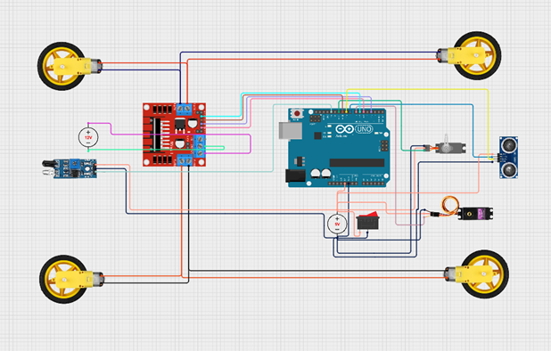

# 🚀 Autonomous Targeting & Shooting Tank
**Project Grade: 10/10 | Robotics Laboratory | Transilvania University of Brașov**

## 📌 Overview
This project features an autonomous robotic system capable of real-time target identification and precision engagement. It was developed to demonstrate advanced hardware-software integration using the Arduino platform.

## 🛠️ Hardware & Software Setup

### 📋 Prerequisites
* **Arduino IDE** (v1.8.x or newer)
* **Components:** Arduino Board, Ultrasonic Sensor, DC Motors/Servos, L298N Motor Driver.

### 🔧 Installation Steps
1. **Hardware:** Connect the components according to the `schema.jpg` uploaded in this repository.
2. **Software:** Download or clone this repository.
3. **Open:** Load `COD_tank.ino` in your Arduino IDE.
4. **Library:** Ensure you have the `NewPing` library installed (if used) for the ultrasonic sensor.
5. **Upload:** Connect your Arduino via USB and hit **Upload**.

##### 🕹️ How it works
The system initializes the sensors and starts scanning for targets. Once a target is detected within the defined range, the control logic triggers the shooting mechanism. 

**Precision:** Using advanced real-time data processing, the turret adjusts its orientation to ensure the projectile hits the **exact center** of the target while maintaining continuous tracking.

## 🛠️ Key Technical Features
**Autonomous Logic:** Implemented real-time decision-making algorithms for target tracking
**Hardware Integration:** Synchronized ultrasonic/optical sensors with servo-actuated firing mechanisms
**Control Systems:** Optimized motor control for precise turret positioning
## 💻 Tech Stack
**Language:** C++ (Arduino IDE)
**Hardware:** Microcontrollers, DC Motors, Servo Motors, Sensors
**Concepts:** Computer Vision, PID Control, Real-time Systems

## 🎓 Academic Context
This project was part of the **Robotics** curriculum at the Faculty of Electrical Engineering and Computer Science (AIA). It received the maximum grade for its complexity and innovative implementation

---
📩 **Contact:** [dragoslungu51@gmail.com](mailto:dragoslungu51@gmail.com)
